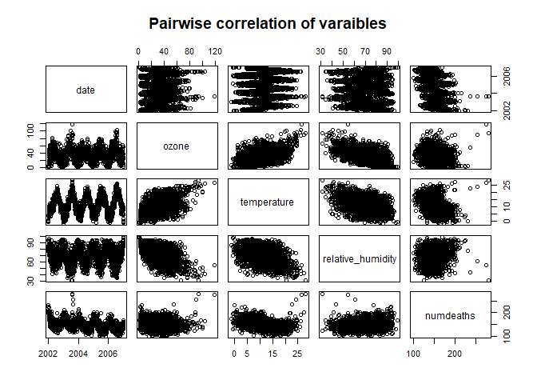
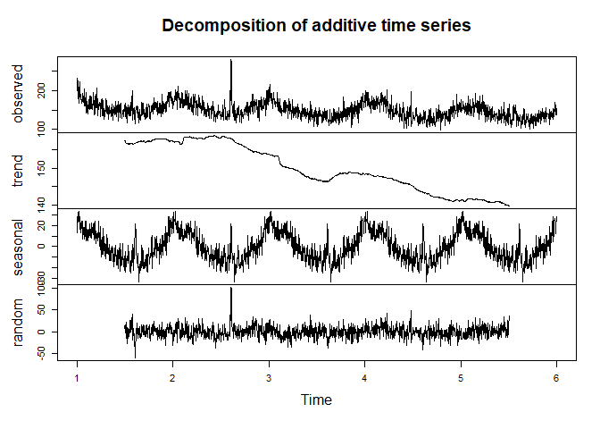
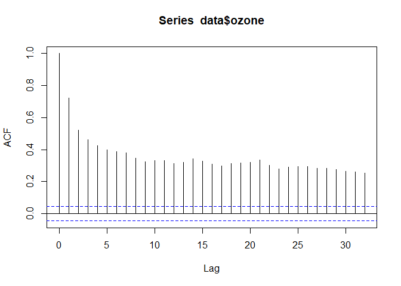
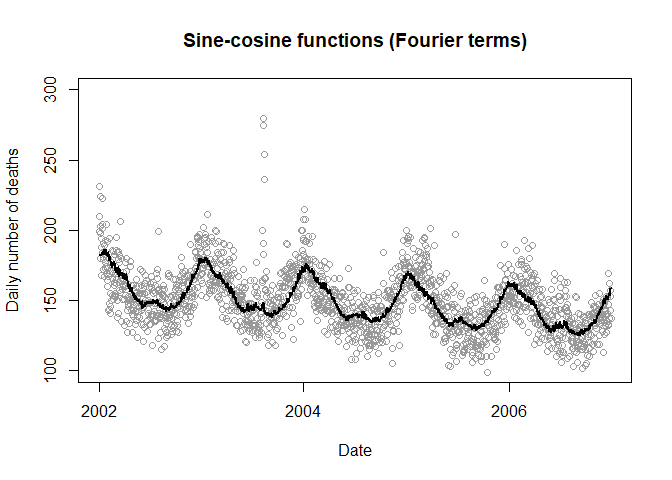
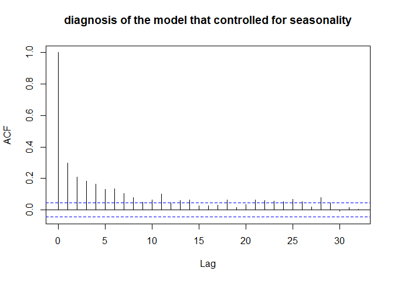
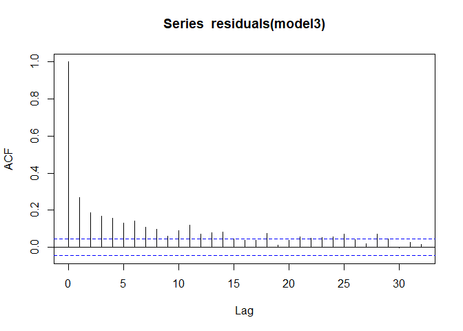
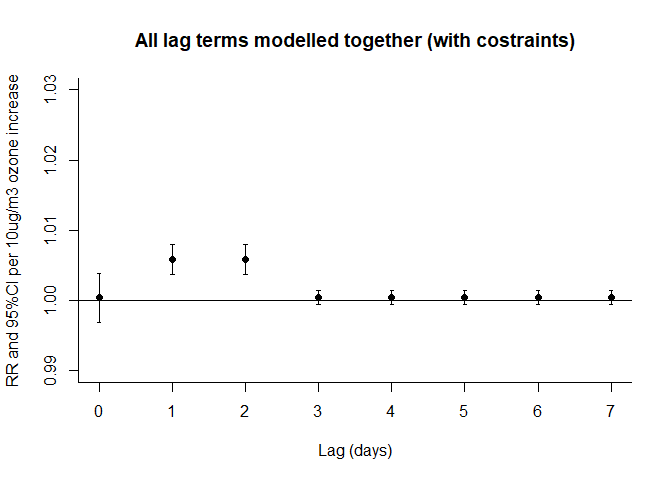
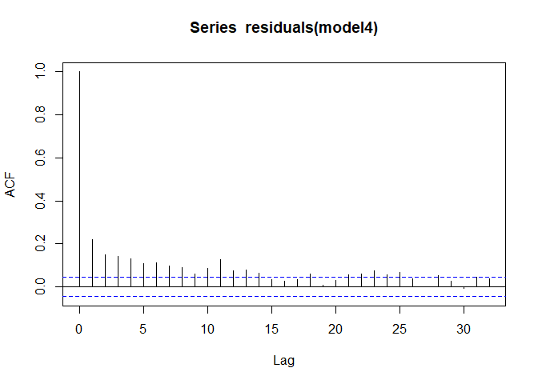
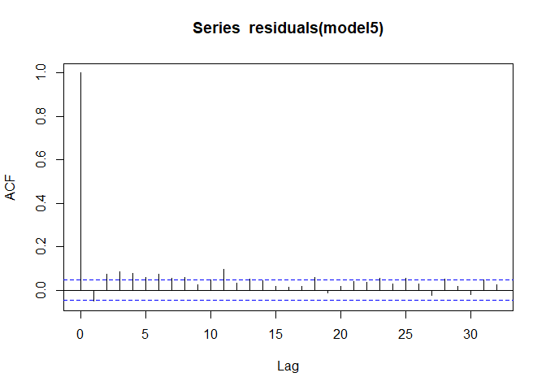

timeSeries_Demo
================
2024-03-10

Some codes and data were borrowed from Dr. Bhaskaran et al
<https://github.com/gasparrini/2013_bhaskaran_IJE_codedata/blob/master/londondataset2002_2006.dta>

*Time series regression studies in environmental epidemiology*
Bhaskaran, Gasparrini, Hajat, Smeeth and Armstrong International Journal
of Epidemiology - 2013
<http://www.ag-myresearch.com/2013_bhaskaran_ije.html>

Extra lines were inserted to make the codes easier to follow and
illustrate the assumptions of time-series data more explicit

### Install or load libraries

``` r
# remove all variables to clean the environment 
rm(list = ls())

# First install the package - !! Once installed, remove the installation commande below or comment out by #, as there is no need to install the same lib again and again, all it takes is to use library() command to load installed library.  
#install.packages("foreign")
#install.packages("dlnm")
#install.packages("tsModel")
#install.packages("Epi")
#install.packages("tidyverse")

# laod the package installed if installed already 
library(foreign) 
library(tidyverse)
library(dlnm)
library(Epi)
library(tsModel)
```

## Describe data

``` r
# Get file directly from web URL, 
data <- read.dta("https://github.com/gasparrini/2013_bhaskaran_IJE_codedata/raw/master/londondataset2002_2006.dta")

# SET THE DEFAULT ACTION FOR MISSING DATA TO na.exclude
# (MISSING EXCLUDED IN ESTIMATION BUT RE-INSERTED IN PREDICTION/RESIDUALS)
options(na.action="na.exclude")


# Display data, only first 5 lines  
head(data, 5)
```

    ##         date    ozone temperature relative_humidity numdeaths
    ## 1 2002-01-01 4.586225 -0.22500001           75.6783       199
    ## 2 2002-01-02 4.876853  0.08749995           77.5250       231
    ## 3 2002-01-03 4.707875  0.85000002           81.3250       210
    ## 4 2002-01-04 4.137461  0.53750002           85.4500       203
    ## 5 2002-01-05 2.005846  4.25000000           93.5250       224

``` r
# Data structure
str(data)
```

    ## 'data.frame':    1826 obs. of  5 variables:
    ##  $ date             : Date, format: "2002-01-01" "2002-01-02" ...
    ##  $ ozone            : num  4.59 4.88 4.71 4.14 2.01 ...
    ##  $ temperature      : num  -0.225 0.0875 0.85 0.5375 4.25 ...
    ##  $ relative_humidity: num  75.7 77.5 81.3 85.4 93.5 ...
    ##  $ numdeaths        : int  199 231 210 203 224 198 180 188 168 194 ...
    ##  - attr(*, "datalabel")= chr ""
    ##  - attr(*, "time.stamp")= chr "14 Aug 2012 20:10"
    ##  - attr(*, "formats")= chr [1:5] "%d" "%9.0g" "%9.0g" "%9.0g" ...
    ##  - attr(*, "types")= int [1:5] 254 254 254 254 252
    ##  - attr(*, "val.labels")= chr [1:5] "" "" "" "" ...
    ##  - attr(*, "var.labels")= chr [1:5] "" "Ozone level in ug/m3" "Temperature in deg C" "Relative humidity in %" ...
    ##  - attr(*, "expansion.fields")=List of 7
    ##   ..$ : chr [1:3] "_dta" "ReS_Xij" "tmean tmax tmin rhm3_9 dep3_9"
    ##   ..$ : chr [1:3] "_dta" "ReS_str" "0"
    ##   ..$ : chr [1:3] "_dta" "ReS_j" "region"
    ##   ..$ : chr [1:3] "_dta" "ReS_ver" "v.2"
    ##   ..$ : chr [1:3] "_dta" "ReS_i" "date"
    ##   ..$ : chr [1:3] "_dta" "_lang_c" "default"
    ##   ..$ : chr [1:3] "_dta" "_lang_list" "default"
    ##  - attr(*, "version")= int 12

``` r
# SUMMARY
summary(data)
```

    ##       date                ozone          temperature     relative_humidity
    ##  Min.   :2002-01-01   Min.   :  1.182   Min.   :-1.401   Min.   :31.23    
    ##  1st Qu.:2003-04-02   1st Qu.: 21.091   1st Qu.: 7.506   1st Qu.:58.69    
    ##  Median :2004-07-01   Median : 34.922   Median :11.473   Median :69.61    
    ##  Mean   :2004-07-01   Mean   : 34.772   Mean   :11.720   Mean   :69.10    
    ##  3rd Qu.:2005-09-30   3rd Qu.: 46.725   3rd Qu.:16.198   3rd Qu.:80.36    
    ##  Max.   :2006-12-31   Max.   :119.246   Max.   :28.175   Max.   :98.86    
    ##    numdeaths    
    ##  Min.   : 99.0  
    ##  1st Qu.:135.0  
    ##  Median :148.0  
    ##  Mean   :149.5  
    ##  3rd Qu.:162.0  
    ##  Max.   :280.0

``` r
# CORRELATIONS across each variables 
cor(data[,2:4])
```

    ##                        ozone temperature relative_humidity
    ## ozone              1.0000000   0.4560300        -0.5269955
    ## temperature        0.4560300   1.0000000        -0.4442078
    ## relative_humidity -0.5269955  -0.4442078         1.0000000

``` r
# plot correlation - takes bit of time of see this plot 
pairs(data, main = "Pairwise correlation of varaibles")
```

<!-- -->

### Make plots for the several time-seriesin the dataset, namely exposure (O3), outcome (death count), temperature, and humidity - the latter two maybe confounders

Apparently winter is more humid in London

``` r
# SET THE PLOTTING PARAMETERS FOR THE PLOT (SEE ?par)
# this allow making two pltos in one window
par(mar=c(2, 2, 2, 2), mex=0.8, mfrow=c(2,1))  # Sets smaller margins
oldpar <- par(no.readonly=TRUE)
par(mex=0.8,mfrow=c(4,1))


# SUB-PLOT FOR DAILY DEATHS, WITH VERTICAL LINES DEFINING YEARS
plot(data$date,data$numdeaths,main="Daily deaths over time",
     ylab="Daily number of deaths", xlab = "week")
## add year line vertical 
abline(v=data$date[grep("-01-01",data$date)],col=grey(0.6),lty=1)


# THE SAME FOR OZONE LEVELS
plot(data$date,data$ozone,main="Ozone levels over time",
     ylab="Daily mean ozone level (ug/m3)",xlab="Date")
abline(v=data$date[grep("-01-01",data$date)],col=grey(0.6))
## add year line vertical 
abline(v=data$date[grep("-01-01",data$date)],col=grey(0.6),lty=1)


# Temperature 
plot(data$date,data$temperature,main="Temperature",
     ylab="Daily temp",xlab="Date")
abline(v=data$date[grep("-01-01",data$date)],col=grey(0.6))


# Humidity 
plot(data$date,data$relative_humidity,main="relative humidity",
     ylab="Daily humidity",xlab="Date")
abline(v=data$date[grep("-01-01",data$date)],col=grey(0.6))
```

<!-- -->

### Decompose into periodic (seasonal) patterns and a long-term trend, plus random error

Y axis represents death count  
so, seasonality and downward trends by whatever unobserved factor may
confound the association between O3 and neath count

``` r
### Plot to decompose time-series 
tsData <- ts(data$numdeaths, frequency = 365)
tsDataDecomposed <- decompose(tsData)
plot(tsDataDecomposed)
```

<!-- -->

``` r
#################
# SCALE EXPOSURE
#################
summary(data$ozone)
```

    ##    Min. 1st Qu.  Median    Mean 3rd Qu.    Max. 
    ##   1.182  21.091  34.922  34.772  46.725 119.246

``` r
data$ozone10 <- data$ozone/10

summary(data$ozone10) # double check scaled or not , new variable ozone10 
```

    ##    Min. 1st Qu.  Median    Mean 3rd Qu.    Max. 
    ##  0.1182  2.1091  3.4922  3.4772  4.6725 11.9246

## How much autocorrelation in your outcome??, check with ACF

Extremely strong across-measurement correlation in in the death count,
meaning that count in one day is very similar to the counts in nearby
days. ACF stands for autocorrealtion function

``` r
acf(data$ozone)
```

<!-- -->

# Analysis

### Lets estimate the association between ozone and death count

### 1. No confounding adjustment, just a crude association between O3 and death count

We will use a family regression that is designed to capture count data
that cannot be negative in value (Poisson regression)

$$ logE(Y_t) = log(\lambda_t) =  \beta_0 + \beta_{ozone} X $$  
$\beta_0$ is intercept term  
$\beta_{ozone}$ is regression coefficient representing the association
between ozone and mortality count

Note that the coefficient below for this analysis is `-0.009364`:
negative sign (if exponentiated to convert into the rate ratio
interpretation, it is less than 1.0) - ozone is protective of death. Is
this a valid result?

``` r
################################################################################
# ESTIMATING OZONE-MORTALITY ASSOCIATION
# (CONTROLLING FOR CONFOUNDERS)
############################################

# COMPARE THE RR (AND CI)
# (COMPUTED WITH THE FUNCTION ci.lin IN PACKAGE Epi, TO BE INSTALLED AND LOADED)

# UNADJUSTED MODEL, only including Ozone 
model1 <- glm(numdeaths ~ ozone,data,family=quasipoisson)  
summary(model1)   
```

    ## 
    ## Call:
    ## glm(formula = numdeaths ~ ozone, family = quasipoisson, data = data)
    ## 
    ## Coefficients:
    ##               Estimate Std. Error t value Pr(>|t|)    
    ## (Intercept)  5.0397683  0.0068866 731.820  < 2e-16 ***
    ## ozone       -0.0009364  0.0001766  -5.301 1.29e-07 ***
    ## ---
    ## Signif. codes:  0 '***' 0.001 '**' 0.01 '*' 0.05 '.' 0.1 ' ' 1
    ## 
    ## (Dispersion parameter for quasipoisson family taken to be 2.831608)
    ## 
    ##     Null deviance: 5129.6  on 1825  degrees of freedom
    ## Residual deviance: 5049.8  on 1824  degrees of freedom
    ## AIC: NA
    ## 
    ## Number of Fisher Scoring iterations: 4

Rate Ratio indicates the rate of death (# number death count divided by
person-time) in response to one unit increase of ozone. The number look
deceivingly small, because it is one unit increase (see the range of
ozone in y axis)  
See the column for the RR `exp(Est.)`..the ratio is leass than 1.0, so
ozone looks protective of dealth, when confounding is not accounted for

``` r
ci.lin(model1,subset="ozone",Exp=T)
```

    ##            Estimate       StdErr         z            P exp(Est.)      2.5%
    ## ozone -0.0009363689 0.0001766441 -5.300877 1.152477e-07 0.9990641 0.9987182
    ##         97.5%
    ## ozone 0.99941

### 2. Lets control for seasonality as a confounder in our model equation above

we will use regression techniques to control seasonality buy adding a
variable that have wave shape through a data transformation involving
sine and cosine function

``` r
#####################################
# OPTION 2: PERIODIC FUNCTIONS MODEL
# (FOURIER TERMS)
#####################################
# GENERATE FOURIER TERMS
# (USE FUNCTION harmonic, IN PACKAGE tsModel TO BE INSTALLED AND THEN LOADED)
# 4 SINE-COSINE PAIRS REPRESENTING DIFFERENT HARMONICS WITH PERIOD 1 YEAR

data$time <- seq(nrow(data))
fourier <- harmonic(data$time,nfreq=4,period=365.25)

# FIT A POISSON MODEL FOURIER TERMS + LINEAR TERM FOR TREND
# (USE OF quasipoisson FAMILY FOR SCALING THE STANDARD ERRORS)
model2 <- glm(numdeaths ~ ozone + fourier + time,data,family=quasipoisson)

# COMPUTE PREDICTED NUMBER OF DEATHS FROM THIS MODEL
pred2 <- predict(model2,type="response")

#############
# FIGURE 2B in the manuscript
#############
plot(data$date,data$numdeaths,ylim=c(100,300),col=grey(0.6),
     main="Sine-cosine functions (Fourier terms)",ylab="Daily number of deaths",
     xlab="Date")
lines(data$date,pred2,lwd=2)
```

<!-- -->

#### Lets diagnose the model that controlled for seasonality.

Compare the strength of autocorrelation (undesirable feature to be
removed) between this plot and the plot without seasonality correction
above. It is not great, but much better than the results from step 1
above ( no control for seasonality)

``` r
#############
# Diagnosis of Model 2
#############
acf(residuals(model2), main = "diagnosis of the model that controlled for seasonality")
```

<!-- -->

Rate Ratio, rate of death (# number of person-time) in response to one
unit increase of ozone Now, the RR of ozone is positive, (or greater
than 1.0 when exponentatied), meaning that ozone is associated with
death after controlling for period effects

``` r
ci.lin(model2,subset="ozone",Exp=T)
```

    ##           Estimate       StdErr        z            P exp(Est.)     2.5%
    ## ozone 0.0005957516 0.0001581656 3.766632 0.0001654647  1.000596 1.000286
    ##          97.5%
    ## ozone 1.000906

### 3. Now control for temperature too

``` r
# (TEMPERATURE MODELLED WITH CATEGORICAL VARIABLES FOR DECILES)
# (MORE SOPHISTICATED APPROACHES ARE AVAILABLE - SEE ARMSTRONG EPIDEMIOLOGY 2006)

cutoffs <- quantile(data$temperature,probs=0:10/10)
data$tempdecile <- cut(data$temperature,breaks=cutoffs,include.lowest=TRUE)

# CONTROLLING FOR TEMPERATURE, plus ozone and seasonality 
model3 <- glm(numdeaths ~ ozone + fourier + time + tempdecile, data,family=quasipoisson)
summary(model3)
```

    ## 
    ## Call:
    ## glm(formula = numdeaths ~ ozone + fourier + time + tempdecile, 
    ##     family = quasipoisson, data = data)
    ## 
    ## Coefficients:
    ##                         Estimate Std. Error t value Pr(>|t|)    
    ## (Intercept)            5.073e+00  1.087e-02 466.682  < 2e-16 ***
    ## ozone                  2.884e-04  1.658e-04   1.740  0.08211 .  
    ## fourier1               5.414e-02  4.821e-03  11.231  < 2e-16 ***
    ## fourier2               5.412e-03  3.975e-03   1.362  0.17352    
    ## fourier3              -5.974e-03  3.536e-03  -1.690  0.09126 .  
    ## fourier4               4.780e-03  3.414e-03   1.400  0.16162    
    ## fourier5               1.171e-01  7.257e-03  16.132  < 2e-16 ***
    ## fourier6               1.617e-02  3.688e-03   4.386 1.22e-05 ***
    ## fourier7               4.027e-03  3.337e-03   1.207  0.22766    
    ## fourier8               1.046e-02  3.333e-03   3.138  0.00173 ** 
    ## time                  -9.494e-05  4.637e-06 -20.476  < 2e-16 ***
    ## tempdecile(4,6.44]    -7.287e-03  1.014e-02  -0.719  0.47243    
    ## tempdecile(6.44,8.27] -2.491e-02  1.052e-02  -2.367  0.01802 *  
    ## tempdecile(8.27,10]   -8.534e-03  1.088e-02  -0.784  0.43314    
    ## tempdecile(10,11.5]   -1.947e-03  1.196e-02  -0.163  0.87072    
    ## tempdecile(11.5,13.3] -7.116e-03  1.315e-02  -0.541  0.58838    
    ## tempdecile(13.3,15.3]  6.424e-03  1.467e-02   0.438  0.66154    
    ## tempdecile(15.3,17]    7.072e-03  1.591e-02   0.445  0.65665    
    ## tempdecile(17,18.9]    1.284e-02  1.682e-02   0.763  0.44537    
    ## tempdecile(18.9,28.2]  9.152e-02  1.791e-02   5.110 3.56e-07 ***
    ## ---
    ## Signif. codes:  0 '***' 0.001 '**' 0.01 '*' 0.05 '.' 0.1 ' ' 1
    ## 
    ## (Dispersion parameter for quasipoisson family taken to be 1.49419)
    ## 
    ##     Null deviance: 5129.6  on 1825  degrees of freedom
    ## Residual deviance: 2635.0  on 1806  degrees of freedom
    ## AIC: NA
    ## 
    ## Number of Fisher Scoring iterations: 4

Lets check RR

``` r
ci.lin(model3,subset="ozone",Exp=T)
```

    ##           Estimate       StdErr        z        P exp(Est.)      2.5%    97.5%
    ## ozone 0.0002884392 0.0001658114 1.739562 0.081936  1.000288 0.9999635 1.000614

Does not look too much better than step 2, controling for season only
…And ACF (autocorrelation) after accounting for temperature

``` r
acf(residuals(model3))
```

<!-- -->

### 4. Now, add lag to exposure: expsoure today will be allowed to impact death count tomorrow, day after tomorrow..and so on using a distributed lag model

``` r
# IN PARTICULAR, THE FUNCTION crossbasis PRODUCES THE TRANSFORMATION FOR 
#   SPECIFIC LAG STRUCTURES AND OPTIONALLY FOR NON-LINEARITY
# THE FUNCTION crosspred INSTEAD PREDICTS ESTIMATED EFFECTS

# PRODUCE THE CROSS-BASIS FOR TEMPERATURE
# AS ABOVE, BUT WITH STRATA DEFINED BY INTERNAL CUT-OFFS
cbtempunc <- crossbasis(data$temperature,lag=c(0,7),
                        argvar=list(fun="strata",breaks=cutoffs[2:10]),
                        arglag=list(fun="integer"))

####################################
# CONSTRAINED (LAG-STRATIFIED) DLM
####################################

# PRODUCE A DIFFERENT CROSS-BASIS FOR OZONE
# USE STRATA FOR LAG STRUCTURE, WITH CUT-OFFS DEFINING RIGHT-OPEN INTERVALS 
cbo3constr <- crossbasis(data$ozone,lag=c(0,7),argvar=list(fun="lin"),
                         arglag=list(fun="strata",breaks=c(1,3)))


model4 <- glm(numdeaths ~ cbo3constr + cbtempunc + fourier + date ,data,family=quasipoisson)
pred4 <- crosspred(cbo3constr,model4,at=10)
```

### Lets plot the lagged impact of ozone on mortality counts over days, in RR

The plot shows the RR of Ozone on day on the same day, next day, day
after…so increased ozone actually influence mortality as a carryover
effect over days, even after ozone level goes down

``` r
#############
# FIGURE 4C
#############

plot(pred4,var=10,type="p",ci="bars",col=1,pch=19,ylim=c(0.99,1.03),
     main="All lag terms modelled together (with costraints)",xlab="Lag (days)",
     ylab="RR and 95%CI per 10ug/m3 ozone increase")
```

<!-- --> Plot
autocorrealtion, there is still residual correlation after accounting
for all the factors like temperature, humidity, lag  
It still does not look perfect…..some varibale maybe missing

``` r
acf(residuals(model4), na.action = na.omit)
```

<!-- -->

### Finally, lets assume that death count in previous day is confoudning the death count today i.e., associated with the exposure ie.g., O3, and death count in next day. In other words, we will control for the lagged outcome of 1 day (previous day) as a confounder.

``` r
# RUN THE MODEL AND OBTAIN PREDICTIONS FOR OZONE LEVEL 10ug/m3
data$y_lag <- NA
data$y_lag  <-  lag(data$numdeaths)

model5 <- glm(numdeaths ~ cbo3constr + cbtempunc + fourier + date + y_lag ,data,family=quasipoisson)
pred5 <- crosspred(cbo3constr,model5,at=10)
```

### Now check ACF after controlling for the death count from previous day

``` r
acf(residuals(model5), na.action = na.omit)
```

<!-- -->
